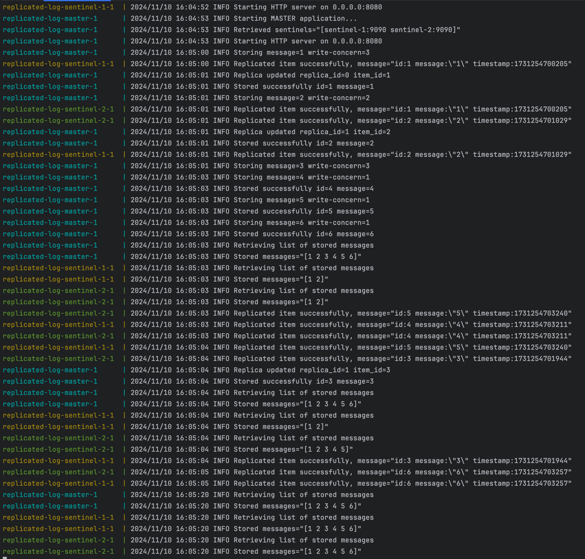

# Replicated log
  
**This is a toy project for trying out Golang and learning some distributed systems concepts.**   
  
## Idea
Master receives messages via `POST /insert` endpoint. It stores message in memory and replicates it to all sentinels.  
Sentinels expose `POST /replicate-item` endpoint that stores messages replicated from master (and should be called only by master).  
All sentinels and master expose `GET /get-all` endpoint that returns list of all stored messages.  

## Requirements
1. All messages on all instances should be stored in the insertion (to master) order.
2. Successful response for `/insert` endpoint should be returned only after successful replication to all instances.
3. `GET /get-all` on all instances should return the same messages in the same order (if no concurrent insertions during `get-all` call).

## Limitations
For now we assume that all requests to sentinels successful and networks always work reliably and there is no additional delays.

## Example of work


## How to run locally

```bash
docker-compose build
docker-compose up
```

These commands will start master on port `8080` and two sentinels on ports `8081` and `8082`.  
Operating locally:

```bash
# insert several messages
curl -X POST http://localhost:8080/insert -d '{"message": "1"}'
curl -X POST http://localhost:8080/insert -d '{"message": "2"}'
curl -X POST http://localhost:8080/insert -d '{"message": "3"}'

# read from master
curl http://localhost:8080/get-all
# read from first sentinel
curl http://localhost:8081/get-all
# read from second sentinel
curl http://localhost:8082/get-all
```

## Algorithm for insertion
1. Store new message locally on master
   1. Acquire lock
   2. Generate new id as last stored id + 1
   3. Insert new item by new id
   4. Release lock
2. For each sentinel in parallel
   1. Send request to sentinel `POST /replicate-item` with message and id
   2. Sentinel inserts item locally by id without locking
   3. Sentinel responds with success
   4. If response successful - send success to result channel
3. Wait for all requests
4. Return success
